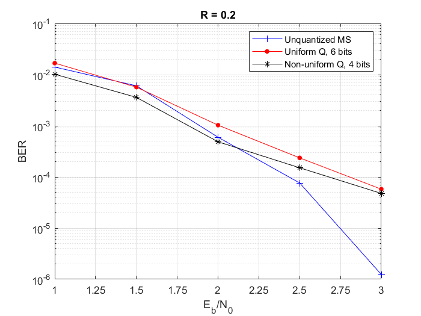

# ldpc-quant
Quantization for LDPC-decoder node messages

Estimation of performance of data transmission system with different parameters:
  - unquantized AWGN-channel and unquantized Min-Sum (MS) decoder
  - uniformly quantized AWGN-channel and discrete MS (6 bits)
  - non-uniformly quantized AWGN-channel and discrete MS (4 bits)
  
To run the simulation:
  simulate(2, 0,'codes/LDPC_5G_K120_R075.alist', 20,[1 1.5 2 2.5 3 3.5 4 4.5 5], 6, 4, 10)
  
Parameters:
   M = 2 for BPSK
   thrf = 0 for calculting the new decoding treshold and quantization bounds (or provide the location of file with computed decoding threshold)
   ldpc_filename - alist file location
   snr_array - snr values to simulate
   q_uniform - number of bits for uniform quantization
   q_nonuniform - number of bits for non-uniform quatization (< q_uniform)
   fe - number of frames with error (the same for unquantized, uniform and non-uniform variants)
    
  </img>
  
  </img>
   
  </img>
       
    
    
